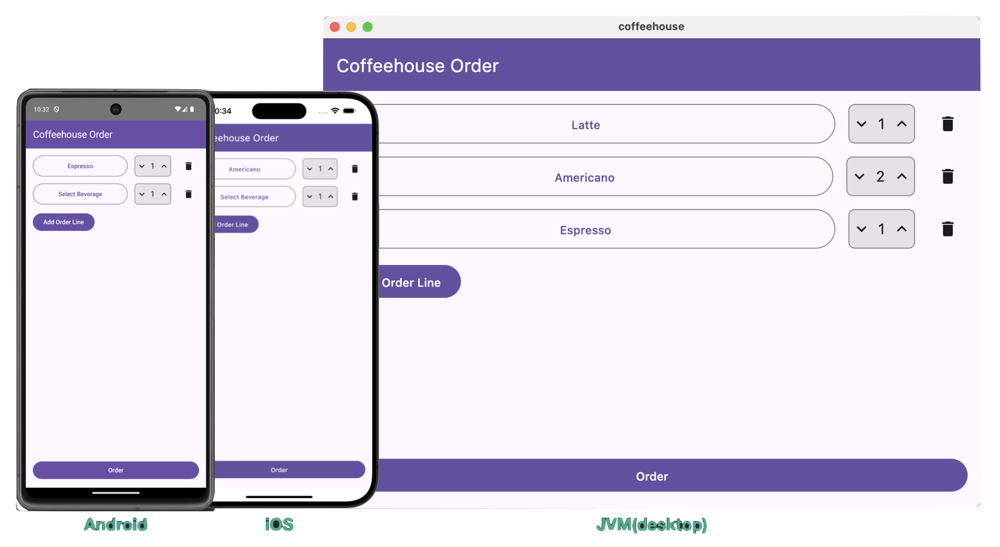

# kotlinx.rpc

kotlinx.rpc는 JetBrains가 개발한 Kotlin 멀티플랫폼 RPC 라이브러리로, 클라이언트와 서버 모두에서 Kotlin 언어의 표준 기능을 활용하여 원격 함수를 호출할 수 있도록 지원합니다. 이를 통해 개발자는 네트워크 프로그래밍의 복잡한 세부사항을 몰라도 마치 로컬 함수처럼 원격 서비스를 호출할 수 있습니다.

이 저장소는 Kotlin의 멀티플랫폼 환경에서 kotlinx.rpc 라이브러리를 활용하여 원격 호출을 구현하는 예제를 제공합니다. 단일 코드베이스를 통해 모바일(Android, iOS), 데스크톱, 서버 등 여러 플랫폼에서 공유 가능한 코드를 작성할 수 있는 방법을 보여줍니다.

## coffeehouse

coffeehouse 예제는 `kotlinx.rpc`를 활용하여 주문 처리 기능을 구현한 멀티플랫폼 프로젝트입니다.

- 컴포즈 멀티플랫폼(Compose Multiplatform)을 함께 사용하여 UI와 비즈니스 로직 대부분을 공유 코드로 작성하였습니다.
- 애플리케이션 외부 설정 정보와 같이 플랫폼별로 특화된 기능은 각 플랫폼 전용 코드로 분리하여 작성되었습니다.

> 코틀린은 JVM 기반 Server-side, Android, 웹/Node.js, iOS, Linux, Windows 등 다양한 플랫폼에서 사용할 수 있습니다. 이를 통해 단일 코드베이스로 여러 플랫폼에 대응하는 애플리케이션을 개발할 수 있습니다.

## grpc-intro

grpc-intro 예제는 `gRPC`를 통해 주문 처리 기능을 구현한 예제입니다.

- 서버: Kotlin으로 작성되어 안정적인 RPC 서버를 구현합니다.
- 클라이언트: Java와 Swift를 사용하여 다양한 플랫폼에서 서버와 통신하는 방식을 보여줍니다.

## Reference

- [kotlinx.rpc - github](https://github.com/Kotlin/kotlinx-rpc)
- [kotlinx.rpc – a brand new approach for multiplatform RPC | Alexander Sysoev](https://youtu.be/C13v_FXmhvU?feature=shared)
- [First steps with Kotlin RPC](https://ktor.io/docs/tutorial-first-steps-with-kotlin-rpc.html)
- [Kotlin Multiplatform](https://kotlinlang.org/docs/multiplatform.html)
